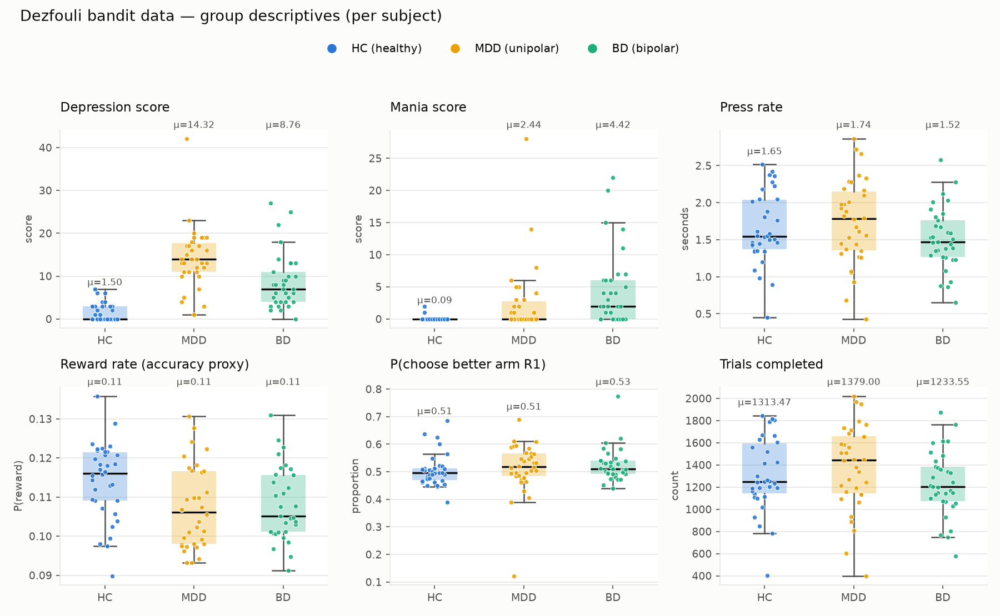
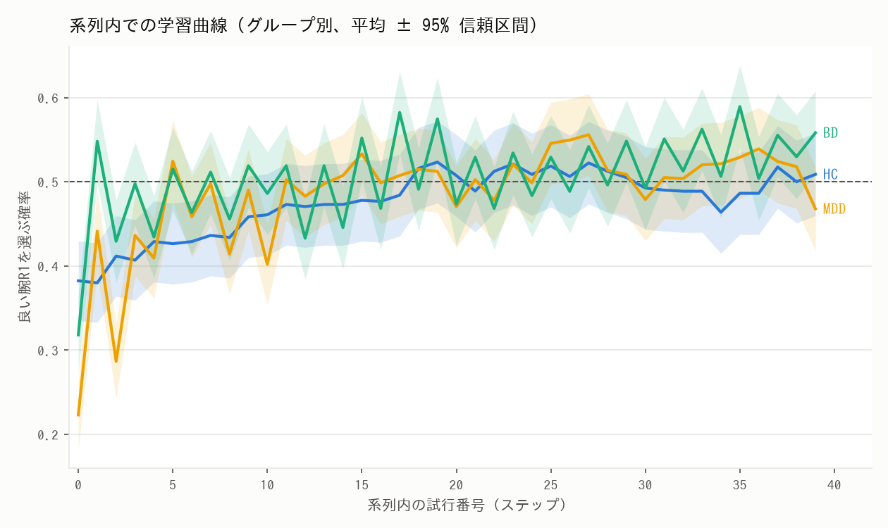

# bandit_MDD_BPD_bandit

Behavioural data (two-armed bandit task) from **Dezfouli et al. (2019)** for
unipolar depression (MDD), bipolar disorder (BD) and healthy controls (HC),
retrieved, validated, preprocessed into an analysis-ready tidy format, and
summarised with group-level descriptive statistics and figures.

- **Task:** two-choice probabilistic bandit (arms R1 / R2).
- **Cohort:** 101 subjects — MDD 34, BD 33, HC 34.
- **Design:** 12 sequences per subject (6 reward conditions × 2 halves) →
  1212 sequences, 132,251 trials total.

## Papers
- Dezfouli, Ashtiani, Ghattas, Nock, Dayan, Ong. *Disentangled behavioural
  representations.* NeurIPS 2019.
- Dezfouli et al. *Models that learn how humans learn: The case of
  decision-making and its disorders.* PLOS Computational Biology, 2019.

## Layout
```
data/
  raw/
    choices_diagno.csv.zip     # verbatim upstream file
    SOURCE.md                  # provenance, links, license
  processed/
    trials.csv                 # one row per trial (analysis ready)
    subjects.csv               # one row per subject (group + clinical scores)
    group_descriptives.csv     # mean / sd / median by group
scripts/
  preprocess.py                # reproducible raw -> processed
  describe.py                  # descriptives + figures
  make_report.py               # build docs/report.pdf
docs/
  report.pdf                   # summary report (stats + figures)
  data_dictionary.md           # column-by-column reference
  figures/
    group_summary.png
    learning_curve.png
  UPSTREAM_LICENSE_Apache-2.0.txt
```

## Reproduce
```bash
pip install pandas matplotlib
python3 scripts/preprocess.py     # raw  -> data/processed/{trials,subjects}.csv
python3 scripts/describe.py       # -> figures + group_descriptives.csv
python3 scripts/make_report.py    # -> docs/report.pdf
```
`preprocess.py` asserts the cohort sizes (34/33/34 = 101) and the 12-sequence
structure before writing.

## Groups & variables
| raw `diag` | code | meaning                   | n   |
|------------|------|---------------------------|-----|
| Depression | MDD  | unipolar major depression | 34  |
| Bipolar    | BD   | bipolar disorder          | 33  |
| Healthy    | HC   | healthy control           | 34  |

**Demographics.** The only subject-level variables in this dataset are the
**diagnosis label** plus two clinical rating scores (`mania_score`,
`depression_score`) and a mean **press rate** (`press_rate_sec`). There is **no
age, sex, IQ, education, or medication** information in the released file; check
the Figshare record (`data/raw/SOURCE.md`) if those are needed.

## Group descriptives (per subject; mean ± sd)
| metric | HC | MDD | BD |
|---|---|---|---|
| Depression score | 1.50 ± 2.06 | 14.32 ± 7.10 | 8.76 ± 6.53 |
| Mania score | 0.09 ± 0.38 | 2.44 ± 5.43 | 4.42 ± 5.84 |
| Press rate (s) | 1.65 ± 0.48 | 1.74 ± 0.57 | 1.52 ± 0.42 |
| Reward rate | 0.114 ± 0.010 | 0.107 ± 0.011 | 0.108 ± 0.009 |
| P(choose better arm R1) | 0.506 ± 0.059 | 0.513 ± 0.093 | 0.526 ± 0.061 |
| Trials completed | 1313 ± 333 | 1379 ± 383 | 1234 ± 292 |

Clinical scores separate the groups as expected (depression highest in MDD,
mania highest in BD); behavioural differences are small — the task uses low
reward probabilities (R1 ≈ 0.08–0.25 vs R2 ≈ 0.05), so preference for the
better arm is weak across all groups. These are descriptive statistics only
(no group-difference tests). Full report: [`docs/report.pdf`](docs/report.pdf).

### Figures



## Data source & license
Raw data was obtained from the authors' implementation repository
<https://github.com/adezfouli/rnn_hypercoder> (`data/BD/`, Apache-2.0). The
canonical dataset is also on Figshare (article `8257259`); see
[`data/raw/SOURCE.md`](data/raw/SOURCE.md) for links and licensing. Please cite
the papers above when using this data.

> Note: at retrieval time (2026-07-07) Figshare / NeurIPS / bioRxiv hosts were
> not reachable from the build environment's network policy, so the raw file was
> sourced from the GitHub mirror, which distributes the identical behavioural
> data.

See [`docs/data_dictionary.md`](docs/data_dictionary.md) for full column
definitions and analysis caveats.
