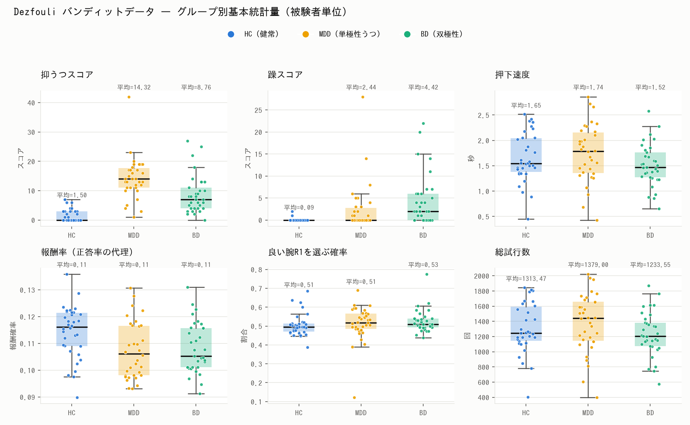

# dezfouli_2019 — 2択バンディット課題（MDD / BD / HC）

> このデータセットはリポジトリ内の一つです。全体像は直下の
> [`README.md`](../../README.md) と [`datasets/README.md`](../README.md) を参照。

**Dezfouli et al. (2019)** による2択バンディット課題の行動データ（単極性うつ病
MDD / 双極性障害 BD / 健常対照 HC）を取得・検証し、分析可能なtidy形式に前処理して、
グループ別の基本統計量と図でまとめたデータセット。

- **課題:** 2択の確率的バンディット（腕 R1 / R2）
- **コホート:** 101名 — MDD 34 / BD 33 / HC 34
- **設計:** 各被験者12系列（6報酬条件 × 2ブロック）→ 1,212系列・132,251試行

## 論文
- Dezfouli, Ashtiani, Ghattas, Nock, Dayan, Ong. *Disentangled behavioural
  representations.* NeurIPS 2019.
- Dezfouli et al. *Models that learn how humans learn: The case of
  decision-making and its disorders.* PLOS Computational Biology, 2019.

## ディレクトリ構成
```
data/
  raw/
    choices_diagno.csv.zip     # 上流の生データそのまま
    SOURCE.md                  # 出所・リンク・ライセンス
  processed/
    trials.csv                 # 試行単位（分析可能）
    subjects.csv               # 被験者単位（グループ＋臨床スコア）
    group_descriptives.csv     # グループ別 平均 / SD / 中央値
scripts/
  preprocess.py                # 生データ → 前処理（再現可能）
  describe.py                  # 記述統計＋図
  make_report.py               # docs/report.pdf を生成
docs/
  report.pdf                   # サマリレポート（統計＋図）
  data_dictionary.md           # カラム定義リファレンス
  figures/
    group_summary.png
    learning_curve.png
  UPSTREAM_LICENSE_Apache-2.0.txt
```

## 再現手順
```bash
pip install pandas matplotlib
python3 scripts/preprocess.py     # 生データ → data/processed/{trials,subjects}.csv
python3 scripts/describe.py       # → 図 + group_descriptives.csv
python3 scripts/make_report.py    # → docs/report.pdf
```
`preprocess.py` は書き出し前に、コホート数（34/33/34 = 101）と12系列構造を
`assert` で検証します。図・PDFの日本語表示には `IPAGothic` フォントを使用します。

## グループと変数
| 元の `diag` | 略号 | 意味            | 人数 |
|-------------|------|-----------------|------|
| Depression  | MDD  | 単極性うつ病    | 34   |
| Bipolar     | BD   | 双極性障害      | 33   |
| Healthy     | HC   | 健常対照        | 34   |

**デモグラフィックについて。** 本データに含まれる被験者単位の変数は、**診断ラベル**と
2つの臨床評価スコア（`mania_score`＝躁、`depression_score`＝抑うつ）、および平均
**押下速度**（`press_rate_sec`）のみです。**年齢・性別・IQ・学歴・服薬**などの情報は
公開ファイルには**含まれていません**。必要な場合は Figshare の記録
（`data/raw/SOURCE.md`）を確認してください。

## グループ別 記述統計（被験者単位・平均 ± SD）
| 指標 | HC | MDD | BD |
|---|---|---|---|
| 抑うつスコア | 1.50 ± 2.06 | 14.32 ± 7.10 | 8.76 ± 6.53 |
| 躁スコア | 0.09 ± 0.38 | 2.44 ± 5.43 | 4.42 ± 5.84 |
| 押下速度 (秒) | 1.65 ± 0.48 | 1.74 ± 0.57 | 1.52 ± 0.42 |
| 報酬率 | 0.114 ± 0.010 | 0.107 ± 0.011 | 0.108 ± 0.009 |
| 良い腕R1選択率 | 0.506 ± 0.059 | 0.513 ± 0.093 | 0.526 ± 0.061 |
| 総試行数 | 1313 ± 333 | 1379 ± 383 | 1234 ± 292 |

臨床スコアは想定どおりグループを分離します（抑うつは MDD が最高、躁は BD が最高）。
一方、行動指標のグループ差は小さいです — 課題の報酬確率が低く（R1 ≈ 0.08〜0.25 に対し
R2 ≈ 0.05）、良い腕への選好が全群で弱いためです。これらは記述統計のみで、群間の統計的
検定は行っていません。詳細なレポート: [`docs/report.pdf`](docs/report.pdf)。

### 図



## データの出所・ライセンス
生データは著者の実装リポジトリ
<https://github.com/adezfouli/rnn_hypercoder>（`data/BD/`, Apache-2.0）から取得しました。
正典データは Figshare（記事 `8257259`）にも公開されています。リンクとライセンスは
[`data/raw/SOURCE.md`](data/raw/SOURCE.md) を参照してください。利用時は上記の論文を
引用してください。

**再配布（クラウド配布等）する場合は [`data/ATTRIBUTION.md`](data/ATTRIBUTION.md) を
データと一緒に必ず同梱**すること（帰属のコピペ用文面・改変内容を記載）。

> 注: 取得時点（2026-07-07）では、この環境のネットワークポリシーにより Figshare /
> NeurIPS / bioRxiv のホストに到達できなかったため、同一の行動データを配布している
> GitHub ミラーから生データを取得しました。

カラム定義と分析上の注意点は
[`docs/data_dictionary.md`](docs/data_dictionary.md) を参照してください。
