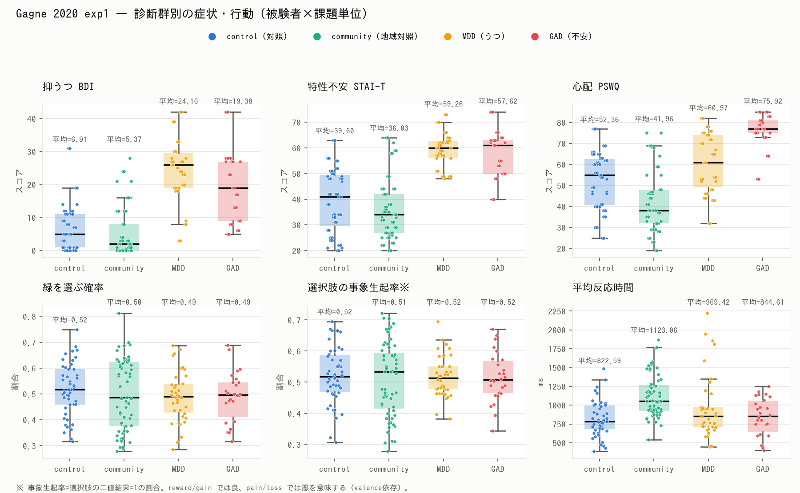
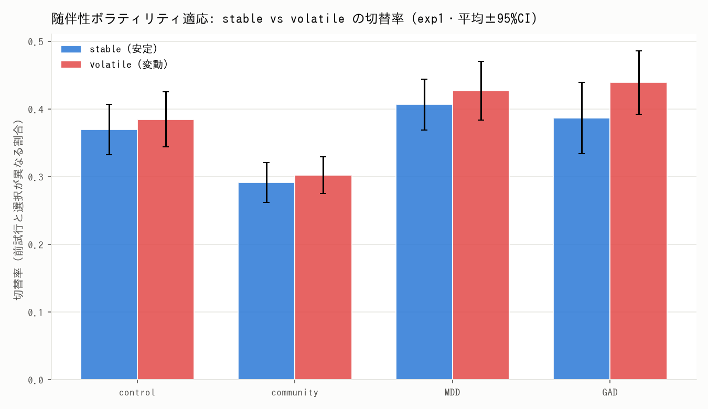

# gagne_2020 — 随伴性ボラティリティ課題（GAD / MDD / 対照・オンライン）

> このデータセットはリポジトリ内の一つです。全体像は直下の
> [`README.md`](../../README.md) と [`datasets/README.md`](../README.md) を参照。

**Gagne, Zika, Dayan, Bishop (2020, eLife)** の確率的2択（緑/青）意思決定課題の
行動データと症状スコアを取得・整形したデータセット。**stable / volatile** ブロックで
随伴性のボラティリティを操作し、内在化精神病理（不安・抑うつ）における学習適応の
障害を調べる。二値結果＋変動ブロックのため **Volatile Kalman Filter（`vkf_bin`）**
等のフィッティングにそのまま使える。

- **課題:** 2択（緑/青）、1条件=180試行（volatile 90 + stable 90、3ラン）
- **exp1（実験室）:** 87名。GAD 26 / MDD 38（患者）・community 59 / control 47（非患者）。条件 pain/reward
- **exp2（オンライン）:** 147名。全員 online の次元的サンプル。条件 gain/loss
- **症状:** BDI, CESD, EPQ.N, MASQ(AA/AD/AS/DS/MS), PSWQ, STAI_Trait(+anx/dep)（exp1のみCFQ / exp2のみSTAI_State）

## ディレクトリ構成
```
data/
  raw/                          # 上流 data/ をそのまま（改変なし・macOS junk除外）
    participant_table_exp{1,2,confirmatory}.csv
    data_raw_exp1/  data_raw_exp2/  item_level_data_for_bifactor_analysis/
    SOURCE.md                   # 出所・DOI・ライセンス（CC-BY 4.0）
  processed/
    trials.csv                  # 試行単位（両実験）
    subjects.csv                # 被験者×課題単位（症状＋群＋行動要約）
    group_descriptives.csv      # exp1 群別サマリ
scripts/
  preprocess.py  describe.py  make_report.py
docs/
  data_dictionary.md  report.pdf  figures/
```

## 再現手順
```bash
pip install pandas matplotlib
cd datasets/gagne_2020
python3 scripts/preprocess.py     # 生データ → data/processed/*.csv
python3 scripts/describe.py       # → docs/figures/*.png
python3 scripts/make_report.py    # → docs/report.pdf
```
`preprocess.py` は選択・結果の符号化を著者コードに合わせて導出し、ブロック値や
二値性を `assert` で検証します。図・PDFの日本語表示には `IPAGothic` を使用します。

## 選択・結果の符号化（重要）
`chose_green=1` が緑、`0` が青。2択の二値結果はブロック内で反相関するため、選択した側の
結果は `outcome_chosen = green_outcome`（緑選択時）/ `1 - green_outcome`（青選択時）。
`outcome_chosen=1` は reward/gain では良い事象、pain/loss では悪い事象（**valence依存**）。
詳細は [`docs/data_dictionary.md`](docs/data_dictionary.md)。

## 基本統計量（要点）
- 症状スコア（BDI/STAI-T/PSWQ/MASQ）は**患者群（GAD/MDD）が対照群より明確に高い**。
- 緑選択率・反応時間などの素の行動指標は群差が小さい。**ボラティリティ適応**（volatile と
  stable の学習の差）を計算モデルで推定して比較するのが本課題の眼目。
- 記述統計のみで群間の統計的検定は未実施。詳細レポート: [`docs/report.pdf`](docs/report.pdf)。

### 図



## 出所・ライセンス
取得元 <https://github.com/crgagne/volatility_paper_elife>（`data/` のみ）。
eLife 論文は **CC-BY 4.0**（DOI: 10.7554/eLife.61387、恒久保管 OSF: osf.io/8mzuj）。
再配布時は論文とOSFを出典明記し、論文を引用すること。詳細は
[`data/raw/SOURCE.md`](data/raw/SOURCE.md)。
